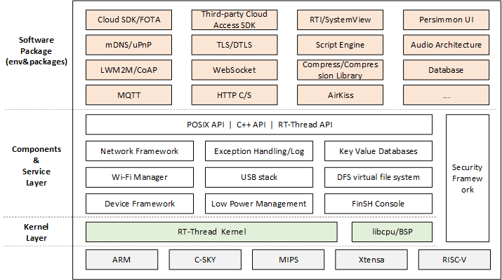

# RT-Thread Introduction 

As a beginner of RTOS, you might be new to RT-Thread. However, with a better understanding of it overtime, you will gradually discover the charm of RT-Thread and its advantages over other RTOSs of the same type. RT-Thread is an Embedded Real-time Operating System (RTOS) . After nearly 12 years of experiences accumulated, along with the rise of the Internet of Things, it is evolving into a powerful, component-rich IoT operating system.  

## RT-Thread Overview 

RT-Thread, short for Real Time-Thread, as its name implies, is an embedded real-time multi-threaded operating system. One of its basic properties is to support multi-tasking. Allowing multiple tasks to run at the same time does not mean that the processor actually performed multiple tasks at the same time. In fact, a processor core can only run one task at a time. Every task is executed quickly, and through the task scheduler  (the scheduler determines the sequence according to priority),  the tasks are switched rapidly which gives the illusion that multiple tasks are running at the same time. In the RT-Thread system, the task is implemented by threads. The thread scheduler in RT-Thread is the task scheduler mentioned above.

RT-Thread is mainly written in C language, easy to understand and easy to port. It applies object-oriented programming methods to real-time system design, making the code elegant, structured, modular, and very tailorable. For resource-constrained Microcontroller Unit (MCU) systems, NANO  version (NANO is a minimum kernel officially released by RT-Thread in July 2017) that requires only 3KB of Flash and 1.2KB of RAM memory resources can be tailored with easy-to-use tools; for resource-rich IoT devices, RT-Thread can use the on-line software package management tool, together with system configuration tools, to achieve intuitive and rapid modular cutting, seamlessly import rich Software f0  eature packs, thus achieving complex functions like Android's graphical interface and touch sliding effects, smart voice interaction effects, and so on.

Compared with the Linux operating system, RT-Thread is small in size, low in cost, low in power consumption and fast in startup. In addition, RT-Thread has high instantaneity and low occupation, which is very suitable for various resource constraints (such as cost, power consumption, etc.). Although the 32-bit MCU is its main operating platform, other CPUs, ones with MMU, ones based on ARM9, ARM11 and even the Cortex-A series CPUs are suitable for RT-Thread in specific applications.

## License Agreement

The RT-Thread system is a completely open source system, the 3.1.0 version and its earlier versions follow the GPL V2 + open source license agreement. Versions from the 3.1.0 version onwards follow the Apache License 2.0 open source license agreement. The RT-Thread system can be used free of charge in commercial products and does not require opening private code to the public.

## RT-Thread Frame

In recent years, the concept of Internet of Things (IoT) has become widely known , and the Internet of Things market has developed rapidly. The networking of embedded devices is the trend of the times. Terminal networking has greatly increased the complexity of software. The traditional RTOS kernel can hardly meet the needs of the market. In this case, the concept of the Internet of Things Operating System (IoT OS) came into being. **IoT operating system refers to the software platform that is based on operating system kernel (like RTOS, Linux, etc.) and includes relatively complete middleware components such as file system, graphics library, etc. It is low in consumption and high in secure, abides by the Communication Protocol and has cloud-connect abilities.** RT-Thread is an IoT OS. 

One of the main differences between RT-Thread and many other RTOS such as FreeRTOS and uC/OS is that it is not only a real-time kernel, but also has a rich middle-tier component, as shown in the following figure.

It includes: 

- Kernel layer: RT-Thread kernel, the core part of RT-Thread, includes the implementation of objects in the kernel system, such as multi-threading and its scheduling, semaphore, mailbox, message queue, memory management, timer, etc.; libcpu/BSP (Chip Migration Related Files/Board Support Package) is closely related to hardware and consists of peripheral drivers and CPU transport. 
- Components and Service Layer: Components are based on upper-level software on top of the RT-Thread kernel, such as virtual file systems, FinSH command-line interfaces, network frameworks, device frameworks, and more. Its modular design allows for high internal cohesion within the assembly and low coupling between components.
- RT-Thread software package: A general-purpose software component running on the RT-Thread IoT operating system platform for different application areas, consisting of description information, source code or library files. RT-Thread provides an open package platform with officially available or developer-supplied packages that provide developers with a choice of reusable packages that are an important part of the RT-Thread ecosystem. The package ecosystem is critical to the choice of an operating system because these packages are highly reusable and modular, making it easy for application developers to build the system they want in the shortest amount of time.  RT-Thread supports more than 60 software packages, listed below: 

1. Internet of Things related software packages: Paho MQTT, WebClient, mongoose, WebTerminal, etc.
2. Scripting language related software packages: JerryScript and MicroPython are currently supported.
3. Multimedia related software packages: Openmv, mupdf.
4. Tools packages: CmBacktrace, EasyFlash, EasyLogger, SystemView.
5. System related software packages: RTGUI, Persimmon UI, lwext4, partition, SQLite, etc.
6. Peripheral library and driver software packages: RealTek RTL8710BN SDK.
7. Others.