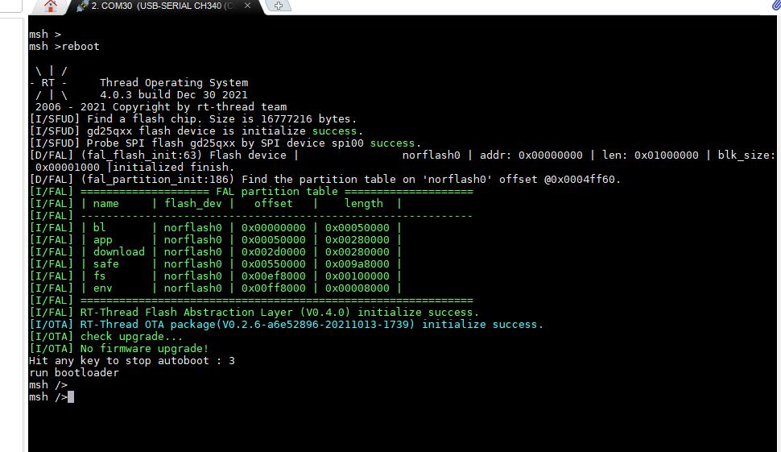
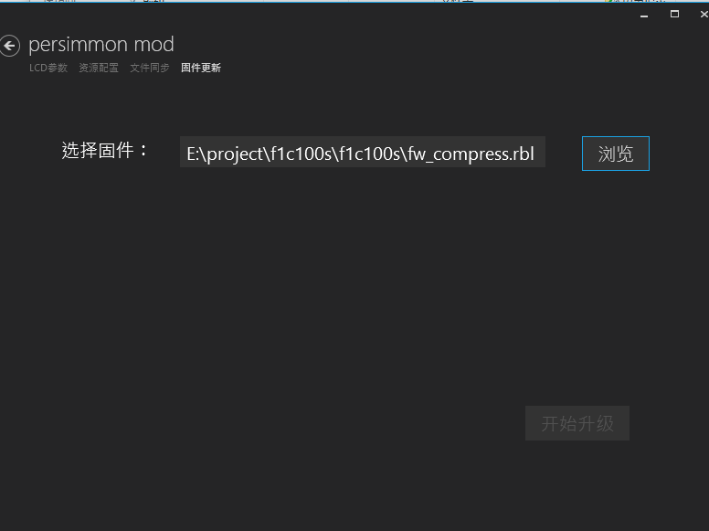

## TINA BSP 使用说明

- 编译

使用下面命令进行编译，默认支持开启主从，但是同一时刻只能用一个。编译完成后生成 **fw_compress.rbl** 文件
```

scons -j12

```

- 板子进入 boot 模式， msh 模式下进入复位，再次按下任意键进入 boot 模式



- 烧录使用 **ConfigTools** 目录中的 **PersimmonModLCDConfigTool.exe** 文件，打开以后选择固件更新，并导入之前生成的 **fw_compress.rbl** 文件,点击 **开始升级**，升级完成后自动跳到应用程序



- msh 下开启从机模式

```

usbd_cdc_start

```

- msh 下开启主机模式

```

usbh_start

```